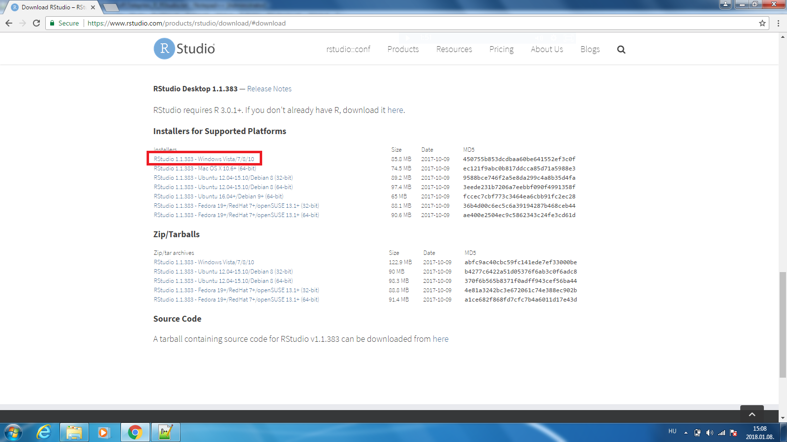
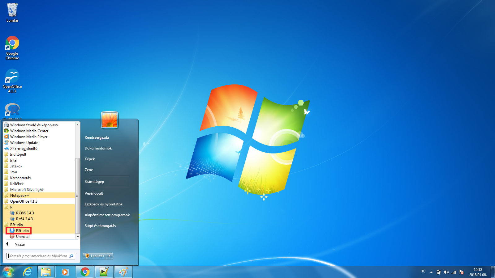
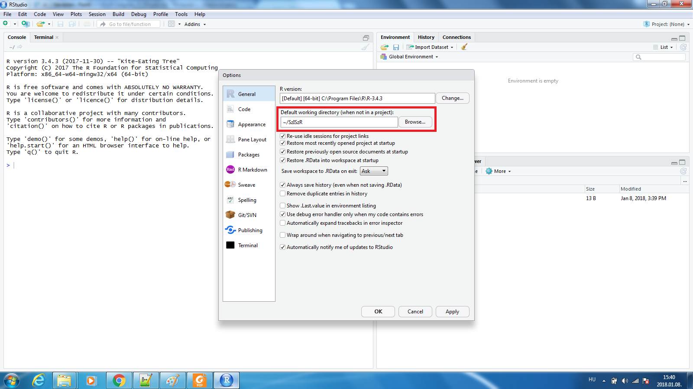
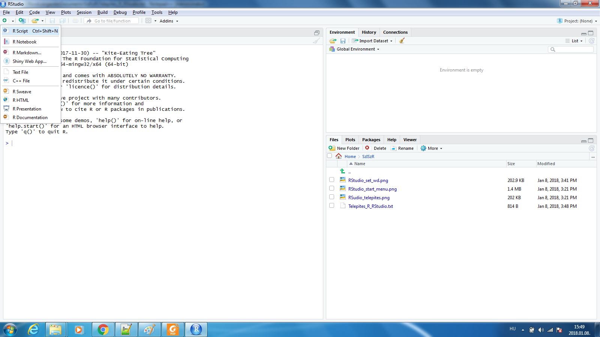
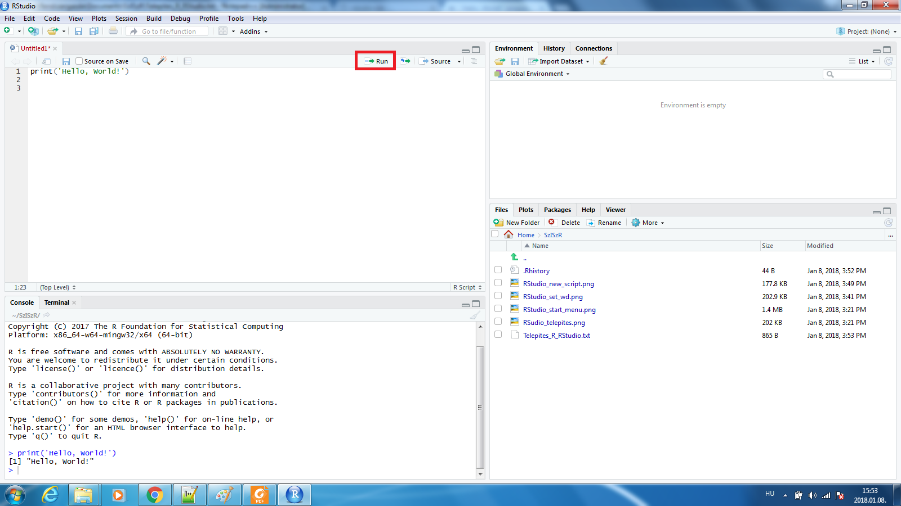

```{r setup, include=FALSE}
knitr::opts_chunk$set(echo = TRUE)
```

## R telepítése

A telepítõ csomag a következõ oldalon érhetõ el Windowshoz:
<https://cran.r-project.org/bin/windows/base/>

Telepítéskor, ha az operációs rendszer 32 bites, akkor a 32 bites verzió települ, ha 64 bites, akkor alapbeállításként mindkettõ.

A kurzuson az R-t elsõsorban R Studion keresztül fogjuk használni, így a nyelvi beállításoknál tetszés szerint választhatjátok bármelyik nyelvet. A telepítés során elfogadhatjátok az alapbeállításokat, nem kell semmit módosítani.

## R Studio telepítése

Az R Studio egy grafikus kezelõ felület, amin keresztül egyszerûbben használható az R. A telepítõcsomag a következõ oldalon érhetõ el: <https://www.rstudio.com/products/rstudio/download/#download>. Újabb Windows verziókhoz ezt kell kiválasztani: *RStudio 1.1.383 - Windows Vista/7/8/10*.



A kurzuson az R Studio angol nyelvû verzióját fogjuk használni. Most is elfogadhatjátok az alapbeállításokat.

Telepítés után a program elérhetõ a Start menübõl vagy a telepítés során megadott mappában.



## Rövid ismerkedés az R Studioval

Ha megnyitottátok az R Studiot, akkor az alapértelmezett könyvtárat itt tudjátok beállítani: *Tools -> Global Options -> General -> Default working directory*
Ide fogja menteni a program a létrejövõ outputokat, és innen próbálja majd megnyitni a scripteket, és más inputokat, ha nem indítotok külön projektet, és nem adtok meg más elérési útvonalat. Érdemes olyan mappát választani, aminek az elérési útvonalában nincs sem ékezetes betû sem szóköz, ez a késõbbiek során megnehezítheti a munkátokat.



Ezt követõen, ha beírjátok a `getwd()` (**get** **w**orking **d**irectory) függvényt a konzolba (Bal oldal Console fül '>' jel után kell begépelni), akkor visszakapjátok az elõbb beállított mappát. Az én esetemben például:

```{r getwd, echo=FALSE}

setwd("C:/Users/Rendszergazda/Documents/SzISzR")
getwd()

```

Az éppen használni kívánt könyvtár a `setwd("path/to/folder")` (**set** **w**orking **d**irectory) függvénnyel is beállítható a konzolon keresztül.

```{r setwd}

setwd("C:/Users/Rendszergazda/Documents/SzISzR")
getwd()

```

Most, hogy túl vagyunk a telepítésen, és az alapbeállításokon, elkezdhetjük használni az R-t. Ha az R Studioban dolgozunk, alapvetõen kétféleképpen kommunikálhatunk a programmal. Egyrészt írhatunk közvetlenül a konzolba, ezt láttuk például a `getwd()` függvénynél, másrészt elõre megírhatjuk egy külön fájlban, úgynevezett scriptben, hogy mit szeretnénk majd csinálni, és lefuttathatjuk ezt egyben vagy részenként. Ha új scriptet szeretnénk kezdeni, akkor ezt a `Ctrl + Shift + N` billentyû kombináció lenyomásával tehetjük meg, vagy az új dokumentum ikonra kattintva, ha az *R Script* lehetõséget választjuk.



Ha megnyílt az új fájl, akkor egyszerûen elkezdhetjük begépelni a parancsokat. Az egyes parancsoknak vagy külön sorra kell kerülniük, vagy pontosvesszõvel kell õket elválasztani. A kezdõ programozók elsõ mûve hagyományosan a *"Hello, világ!"* program, úgyhogy kezdjünk mi is ezzel. Ha beírjuk a script fájlba, hogy `print('Hello, World!')`, majd a kurzorral a parancs sorában megnyomjuk a `Ctr + R` billentyû kombinációt vagy a *Run* ikont a script ablakában, akkor le is futtattuk az elsõ scriptünket. A konzolon látjuk az eredményt, az R kinyomtatja a zárójelen belül kért szöveget:

```{r hello_world}

print('Hello, World!')

```



Attól függõen, hogy milyen operációs rendszeren fut az R, a billentyû kombinációk eltérõek lehetnek. Ezek a beállítások a *Tools -> Modify Keyboard Shortcuts* menüpontban módosíthatóak.

Ha szeretnétek segítséget kapni a használt függvényekkel kapcsolatban, akkor azt a `help(func_name)` parancs segítségével tehetitek meg. A `print` parancs esetében például a `help(print)` kifejezést kell a konzolban vagy a scripten keresztül lefuttatni. A függvény leírása, ha alapbeállításokat használtok, a jobb alsó sarokban a *Help* fülön jelenik meg.

Ha a megírt scriptet szeretnénk elmenteni késõbbi használatra, akkor a fájl '.R' végzõdést kell, hogy kapjon, például *hello_world.R*.

Az R-ben elérhetõ az összes [matematikai alapmûvelet](https://stat.ethz.ch/R-manual/R-devel/library/base/html/Arithmetic.html), ha szeretnétek kicsit ismerkedni még az R-rel, akkor ezek kipróbálhatóak a konzolba írva és scriptbõl futtatva. A mûveletek eredményei elmenthetõek változókban. A változókat nem kell elõre létrehozni, a tartalmuk és a típusuk pedig dinamikusan változhat, de errõl majd az órákon beszélünk kicsit bõvebben. A példákban a `#` kezdetû részek kommentek, az adott sorban az utánuk következõ rész nem fut le, csak megjeleníti a konzol. 

```{r math_eg, error=TRUE}

# Matematikai mûveletek

1+1 # 2
5*2 + 7/2 # 13,5
2**3 # 8
5%%2 # 1


# Változók használata: '<-' jellel rendelünk változókhoz értékeket

a <- 1
b <- 2

a + b # 3


# A változók értékét és típusát bármikor megváltoztathatjuk

a <- "a"
b <- "b"

print(a) #a


# Ha több változó értékét akarjuk kinyomtatni, össze kell õket fûzni egy vektorrá 
# A syntax: c(elem1,elem2...elemn) 

print(c(a,b)) # "a" "b"


# Ha rossz syntaxot használunk, hibaüzenetet, és esetleges további figyelmeztetõ üzeneteket kapunk

print(a,b) # a print függvény egy változót képes kezelni, mi kettõt adtunk meg


# Változók az rm() paranccsal törölhetõk

rm(a)
print(a) # hibaüzenetet kapunk, már nem létezik a változó

```


Végezetül pár szó az R Studioban beállítható panelekrõl, amiket az R Studio ablakban láttok:

* **Source:** ide írjuk a scripteket, pl. az elõbb a 'Hello, világ!' programot
* **Console:** itt jelenik meg a script futtatás eredménye
* **Environment, History, Connections:** itt láthatóak például a létrehozott változók, a futtatott parancsok historikusan
* **Files, Plots, Packages, Help, Viewer:** itt látjuk a working directory tartalmát, a létrehozott plotokat, a telepített, és a session-ön belül betöltött package-eket 

A panelek elrendezése és tartalma a *Tools -> Global Options -> Pane Layout* menüben módosítható.