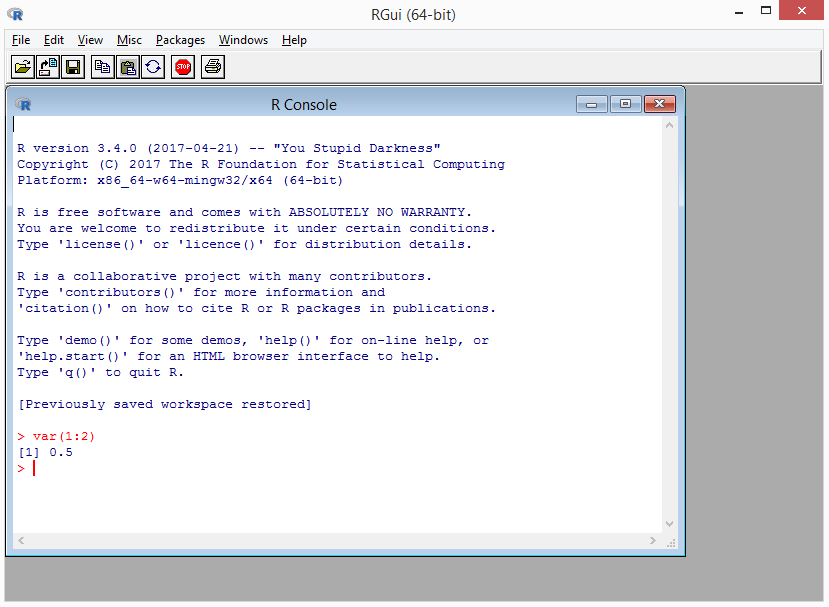
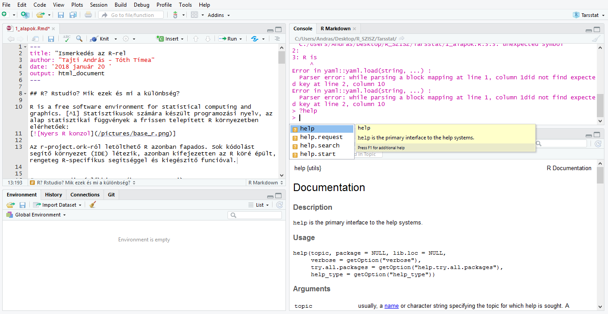

## R? Rstudio? Mik ezek és mi a különbség?

"R is a free software environment for statistical computing and graphics." Statisztikusok számára készült programozási nyelv, az alap statisztikai függvények a frissen telepített R környezetben elérhetőek:



Az r-project.ork-ról letölthető R-rel viszont nehéz dolgozni. Sok kódolást segítő környezet (IDE) létezik, ezeket is lehet használni, az RStudio azonban kifejezetten az R köré épült, rengeteg R-specifikus segítséggel és kiegészítő funcióval:



A kódolást segítő funciók között van az instant help, az automatikus kódformázás, szintaktikai elenőrzés, Markdown dokumentumok fordítása, Shiny alkalmazások fejlesztésének segítése, stb.

## Hogyan és mire lehet használni?

### Alapműveletek, logikai műveletek elvégzésére:

```{r alapműveletek}
1 < 2
1 > 2
1 == 2
1 + 1
1 : 4
2 ^ 2
1 / 4
1:4 / 4
1:4 / 2:1
```


### Különböző adatok és eredmények tárolására:

```{r adattipusok}
szam <- 1
szam

betu <- "b"
betu

vektor <- 1:4
vektor

mat <- matrix(1:9, nrow=3)
mat

fact <- factor(c("Község", "Város", "Megyeszékhely", "Város", "Város"))
fact

egyszeru_fuggveny <- function(){1}
egyszeru_fuggveny
egyszeru_fuggveny()

negyzet_fuggveny <- function(x){x^2}
negyzet_fuggveny(2)

osszevont_vektor <- c(b=betu, sz=szam, f=fact)
str(osszevont_vektor)
lista <- list(b=betu, sz=szam, v=vektor, f=negyzet_fuggveny)
str(lista)

```

*Feladat: Készítsetek egy vektort, ami megmondja, hogy 1-től 10-ig egy szám páratlan-e, vagy páros!*

```{r paros_paratlan, echo = FALSE}
1:10 %% 2
```

*Feladat: írjatok egy függvényt, ami megmondja, hogy egy adott vektorban szereplő értékeknek mekkora a varianciája!*

```{r variancia, echo=FALSE, results = "hide"}

variancia <- function(x){
  d <- mean((x - mean(x))^2)
  return(d)
}

variancia(1:4) == var(1:4)

```

### Adattáblák létrehozására

Az adatok tárolására az alap R-ben a data.frame nevű objektum szolgál:

```{r data.frame}
adatok <- data.frame(
  id = 1:10,
  szul_ido = sample(x = 1950:2000,
                     size =10),
  telepules_kat = as.factor(sample(
                             x = c("Főváros", "Város", "Község"),
                             size = 10,
                             replace = TRUE, 
                             prob = c(2, 4, 4)))
)
adatok$havi_jov <- (2018 - adatok$szul_ido) * 1000 +
                   rnorm(10, 0, 4000)
```


### Véletlen számok generálására:

```{r veletlenek}
egyenletes_eloszlas <- runif(100)
plot(egyenletes_eloszlas,
     ylab="Érték",
     main="Egyenletes eloszásból generált értékek")
hist(egyenletes_eloszlas,
     main="Egyenletes eloszlás hisztogramja")

binomialis_eloszlas <- rbinom(100, 60, 1/6)
plot(binomialis_eloszlas,
     ylab="Érték",
     main="Binomiális eloszásból generált értékek")
hist(binomialis_eloszlas,
     main="Binomiális eloszlás hisztogramja")
plot(density(binomialis_eloszlas))
```

*Feladat: Nézzétek meg, mekkora egy tetszőleges paraméterekkel generált normáleloszlás átlagának eltérése a várható értékétől! Futtassátok le a függvényt többször, mit tapasztaltok? Módosítsátok a paramétereket, és futtassátok le úgy a függvényt, mire számítunk?*

```{r varhato_ertek, echo = FALSE, results = FALSE}
kulonbseg <- abs(50 - mean(rnorm(1000, 50, 20)))
kulonbseg
```

Ha random számokat generálunk, és azt szeretnénk, hogy az eredményeink reprodukálhatóak legyenek, akkor azt a `set.seed()` függvénnyel érhetjük el, ezzel "rögzítjük" a random szám generálás kezdőpontját.

```{r set_seed}
# Ha beállítjátok azonos értékre a seedet a saját gépeteken, azonos eredményt kell kapnotok
set.seed(123)

mean(rnorm(1000, 50, 20))
mean(rnorm(1000, 50, 20))
mean(rnorm(1000, 50, 20))
```


### Stringek kezelésére

```{r szövegek}
# keresés, csere:
grepl(pattern = "keresett",
      x = c("a keresett szöveg megtalálható", "ebben pedig nem"))
gsub(pattern = "cserél",
     replacement = "kicserél",
     x = c("Ebben cserélni fog a függvény",
           "ebben is megtalálja a kicserélendő részt",
           "ezt békén fogja hagyni"))
```

### Modell építésre

A modellek is függvények, amik általában úgynevezett `formulá`kat használnak. Ezek segítségével gyorsan meghatározhatjuk az elvégzendő vizsgálatokat. Ilyen például a regressziót számoló `lm` függvény:

```{r formula}
plot(adatok$szul_ido, adatok$havi_jov,
     xlab = "Válaszadó életkora",
     ylab = "Válaszadó átlagos havi jövedelme",
     main = "Életkor és jövedelem összefüggése")

lin_reg <- lm(szul_ido ~ havi_jov,
              data = adatok)
lin_reg
summary(lin_reg)
```

# Ide hiányzik if és loop!

### Saját függvények megírására

Az R egyik nagy erőssége, hogy ha nem találjuk meg a szükséges statisztikai eljárást a felkínált függvények közt, megírhatjuk magunk is őket, illetve akár komolyabb programokat is készíthetünk a felkínált programozási alapelemekkel:

- sokszor egymás után elvégeztethetjük a számítógéppel ugyanazt a feladatot:

```{r szorzas}
szorzas <- function(x, n){
  eredmeny <- 0
  for(i in seq(n)){
    eredmeny <- eredmeny + x
  }
  return(eredmeny)
}
```

- az eljárásban döntéseket hozhatunk bizonyos feltételek alapján

```{r dontes}
for(i in 1:20){
  if(i %% 2 == 1){
    pp <- "páratlan"
  } else {
    pp <- "páros"
  }
  
  print(paste(i, ":", pp))
}
```

*Feladat: Írjatok egy függvényt, ami 1-től 20-ig végignézi a számokat. Ha hárommal osztható, kiírja hogy `Fizz`, ha öttel, kiírja hogy `Buzz`, ha mindkettővel, kiírja hogy `FizzBuzz`.*

```{r FizzBuzz, echo = FALSE, results = FALSE}
for(i in 1:20){
  r <- NULL
  if(i %% 5 == 0 & i %% 3 == 0){
    r <- "FizzBuzz"
  } else if(i %% 3 == 0){
    r <- "Fizz"
  } else if(i %% 5 == 0){
    r <-  "Buzz"
  } else {
    r <- i
  }
  print(r)
}
```


### Adatbeolvasására, kiírására

A adatokat a legtöbb esetben mi vagy mások nem a konzolba vagy a terminálba gépeljük be, hanem egy fájlban érkezik meg, többnyire csv vagy más hasonló tabuláris formátumban, ahonnan beolvassuk őket. Ezek mellett az R képes sok más statisztikai célú program adatformátumának beolvasására is (ld.  `help(package="foreign")`).

# read.table!

```{r adatbeolvasás}

# CSV
csv_adat <- read.csv2("data/hungapminder.csv")
str(csv_adat)

# SPSS
library(foreign)
spss_adat <- read.spss("data/electric.sav",
                       to.data.frame=TRUE)
str(spss_adat)

# Internetről közvetlenül
pandas <- read.csv2("https://www.eea.europa.eu/data-and-maps/data/european-red-lists/european-red-list-of-mammals/european-red-list-of-mammals-csv/at_download/file")
str(pandas)
```

Természetesen sok előkészítés, elemzés, újabb módosítás, újabb elemzés során az adatokat néha érdemes el is menteni. Ha csak egyszerűen az R-ben szeretnénk újra felhasználni valamit, a legegyszerűbb a saját formátumát használni, megosztáshoz azonban érdemes egy széleskörűen választott formátumot vagy platformot választani (a csv-t szinte mindenki érti).

# write.table!

```{r mentés}
# az R saját formátumába:
saveRDS(adatok,
        "data/sajat_adat.RDS")
# csv-be:
write.csv2(adatok,
          "data/sajat_adat.csv")
# stata, spss:
write.foreign(adatok,
              datafile = "data/sajat_adat.sav",
              codefile = "data/sajat_adat.sps",
              package = "SPSS")
```


Az adatok beolvasására és kiírására rengeteg lehetőség adódik, az  önkéntes alapon fejlesztett csomagok közül nagyon sok foglalkozik azzal, hogy R-ből lehessen relációs adatbázisba, internetes szolgáltatásra, NoSQL adatbázisra kapcsolódni, újabb és újabb bináris formátumokból olvasni és írni. 

## Csomagok

Az `R` egyik legnagyobb ereje a szabadon hozzáférhető csomagokban van. Ezek olyan függvénygyűjtemények, amiket mások leprogramoztak, leteszteltek, ledokumentáltak, mi pedig élvezhetjük hogy bővítik vagy javítják az elérhető funkciókat. Ilyenek az inputtal és outputtal foglalkozó csomagok, külön szekciója van a térstatisztikával foglalkozó csomagoknak, illetve óriási szeletet harapnak ki a vizualizációval foglalkozó megoldások is. Azonban sok foglalkozik már meglévő funkciók javításával, rendszerezésével, gyorsításával is. A csomagok közül természetesen sok használ fel más csomagokat, így egy-egy csomag akár 10 másik csomag telepítésével is járhat - ettől azonban a legtöbb esetben nem szükséges megijedni, a telepítés során biztos nem fogja egy-egy csomag megenni a tárhely jelentős részét. Telepítsünk is kettőt:

```{r csomagok}
install.packages(c("data.table", "tidyverse", dependencies = TRUE),
                 repos = "http://cran.rapporter.net")

library(data.table)
library(tidyverse)
```

## Tippek, trükkök

- Kódstílus: érdemes egy adott, átlátható és olvasható kódot írni - azt ugyanis nem a számítógép, hanem a jövőbeni én számára írjuk. A pontos stílus tulajdonképpen kevésbé fontos, mint az, hogy amit választunk, ahhoz tartsuk magunkat.
- Érdemes egy R script elején leírni, mit csinál a kód, illetve hogyan tagolódik különböző "fejezetekre", amiket a kódban érdemes jelölni is. Egy egyszerű elemzés során az alábbi fejezetek szinte biztos előfordulnak: 

    1. Adatbetöltés 
    2. Adattisztítás 
    3. Elemzendő változók kiszámítása 
    4. Vizsgálat
    5. Eredmények elmentése


- Rengeteg blogbejegyzés foglalkozik a kiinduló, köztes és feldolgozott adatok, az eredmények és a szkriptek elrendezésével. A legtöbb lényege, hogy a kutatási anyagok mind megtalálhatóak legyenek egy mappán belül. Külön mappában érdemes tartani a kiinduló adatokat, hogy véletlenül se írhassuk felül őket, külön mappát érdemes fentartani a szkripteknek és az eredményeknek. Az sem árt, ha az egyes fájlok sejtetik hogy mit tartalmaznak,illetve a fájlnév alapján össze lehet kötni a az elkészült fájlt az elkészítő szkripttel.
- Sok féle-fajta hiba, figyelmeztetés szokott megjelenni egy kód (akár a tervezettnek megfelelő) futása esetén is. Ha nem találod a hibát a zárójeleknél, változóneveknél, akkor érdemes megnézni, mit ír a help - ugyanis gyakran az általunk, illetve a függvény írója által elképzelt működés közti különbség a hiba oka. Ha ez sem vezet eredményre, rendszeres használat mellett a Google viszonylag hamar jó találatokat ad, ha a hiaüzenetre keresünk rá, pár kiegészítő információval. Tipikus keresés az "`R <függvénynév> <hibaüzenet>`".
- Mielőtt valamilyen statisztikai módszert vagy egyéb eszközt elkezdenénk lekódolni, érdemes rákeresni - nagy valószínűséggel valaki belefutott már ugyanabba az eszközhiányba, és az is lehet, hogy le is programozta és elérhetővé tette egy csomagban, vagy csak meg lehet találni egy blogbejegyzésben, kommentben.


## Házi feladat:
Válasszatok egy tetszőleges adatforrást (csv vagy SPSS file ajánlott), és olvassátok be R-be. Írjatok egy függvényt, amivel kategorizáltok egy magas mérési szintű változót, illetve egy másikat, amivel recode-oltok egy nominális vagy ordinális változót. A kiinduló adatokat és a működő szkriptet küldjétek el egy zipben nekünk.

# recode, cut

Jó munkát!
